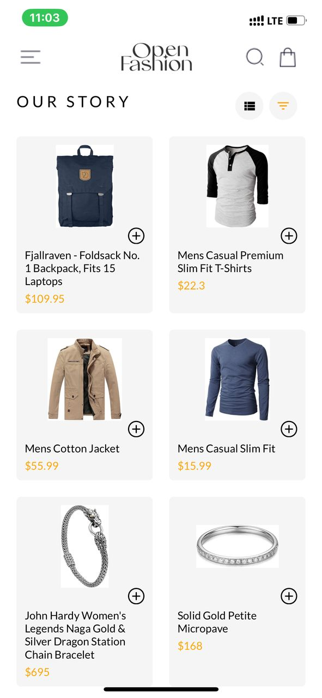
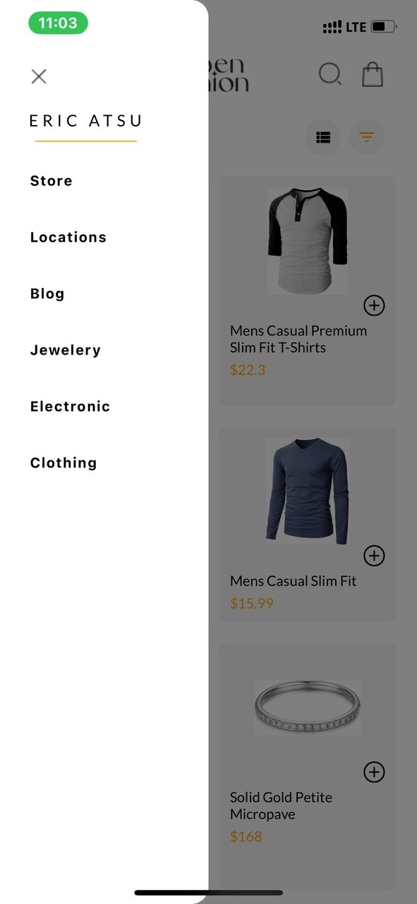
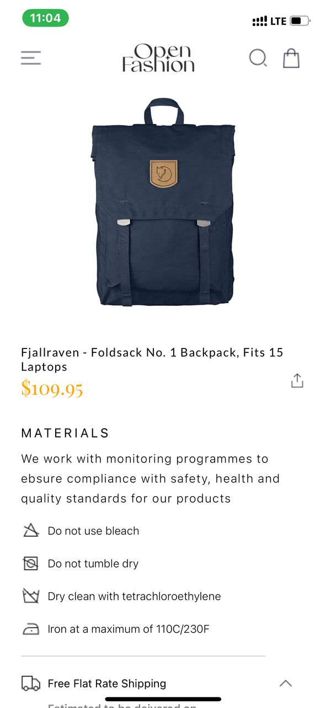
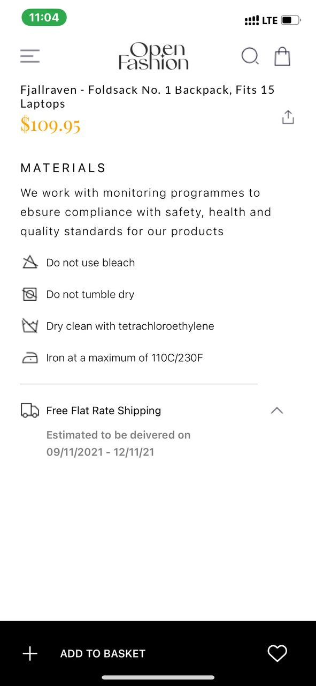
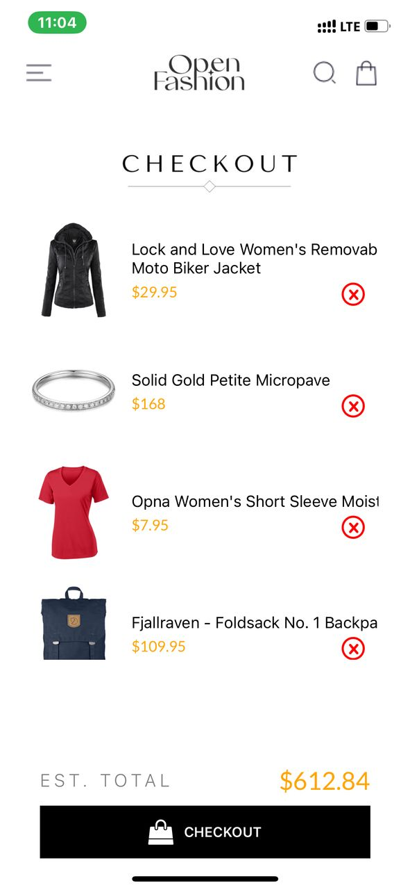

## Overview

This React Native project integrates product listing, a product detail view, a shopping cart, and local data storage using AsyncStorage. The app fetches data from an external API and allows users to interact with products in a cart-style interface.

## Project Structure
- */screens*: Contains all screens in the UI mockup including a product-detail screen and a cart screen which are hidden.

- */context*: Contains the cart context for managing cart state across screens.

- */assets*: Contains icons and images used in the app.

- */components*: Holds a reusable custom component used in the product-detail screen

## Design
- The design folloes the UI mockup provided in the assingnment. The layout uses a grid display for products and consistent spacing/styling for elements. 

## Design Decisions
- *Context Api* was used to manage the cart because it allows a centralized and clean state management approach across multiple screens in the app

- *Async/Await* was used with fetch() for API data loading

- *AsyncStorage* was used for simple local storage needs

## Features

- *Home Screen*
  - Displays a list of available products (fetched from the FakeStore API).
  - Each product shows its image, title, and price.
  - Users can navigate to a detailed product view or add the product directly to the cart.

- *Product Detail Screen*
  - Shows detailed information about the selected product.

- *Cart Screen*
  - Displays items added to the cart.
  - Users can remove items from the cart.

- *Drawer Navigation*
  - Allows easy access to the Home and other.

- *Cart Functionality*
  - Add and remove products from the cart.
  - Cart updates in real-time across screens using React Context API.

- *Local Storage*
  - Cart items are saved locally using AsyncStorage so users don’t lose their cart when they close the app.

## Screenshots

 

 

